# Plated in Gold: What Drives Apple Smartwatch Resale Prices?

We analyze thousands of third-party Apple smartwatch listings, web-scraped from online marketplaces, to provide a snapshot of the market and learn which factors most impact list price. The dataset contains information of condition, seller ID, case size, country of listing, international shipping availability, price, and a title column. From the title column we use regex to extract the model, premium markers like Hèrmes special editions and materials like titanium and ceramic, and aftermarket additions such as 24k gold plating. 

It's important to state right away the largest caveat of this dataset: these are list prices, not completed transactions. However, we believe that analyses of this type of data are still meaningful, and can help us understand, for example, which product, seller, and geographic characteristics are associated with differences in asking prices. Moreover, as we'll see below, it can reveal unusual pricing patterns that warrant further investigation.

We use CatBoost Regressor, a Python ML package developed to handle datasets with high-dimensional categorical variables, plus SHapley Additive exPlanations (SHAP) to arrive at a ranking of features by importance to list price.

  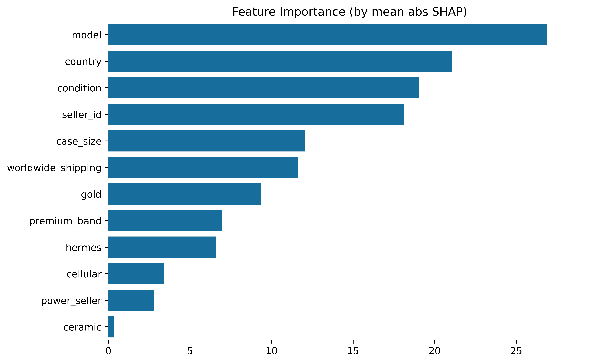

  <em>Units are in USD. Bigger bar = greater impact</em>

For those unfamiliar with SHAP, this ranking tells us specifically how our predictive price model assigns value to individual features. Smartwatch model is the most important, with about $27 worth of weight, followed by country, condition, and seller id. We explain more about SHAP and how we arrived at this ranking in the section [What is SHAP](#what-is-shap). 

### SHAP can help us avoid common pitfalls

Let us highlight an interesting nuance sometimes present in this type of data: When grouped by model, and arranged in order of average price, outdated models such as Series 2, 3 and 4 are actually listed higher than even the current-gen flagship Ultra 3. 

  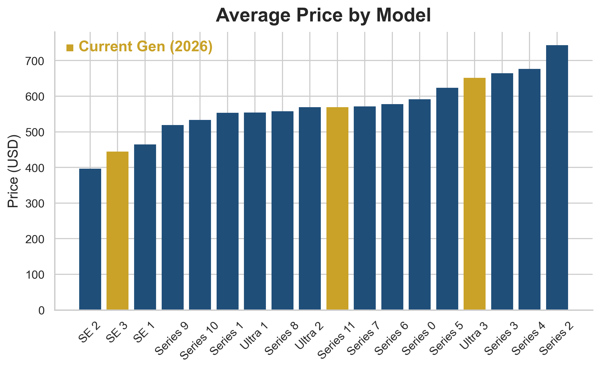

Is this just wishful thinking, or perhaps predatory bait-pricing on the sellers' behalf? When we dig a little deeper, we notice that many of these models are actually aftermarket plated in 24k gold. This led us to engineer the binary feature called 'gold', and when we look at Series 2,3, and 4 watches, we see that a high percentage of them are gold-plated. Gold-plated watches were listed for, on average, 50% more than their standard counterparts. 

  

Notice that the top three most highly-plated models, the Series 2, 4 and 3, are also the top three highest priced models. Notice also that no current-gen models are aftermarket gold-plated. However, as we will see in [Directions for Future Research](#directions-for-future-research), gold-plating does not completely resolve the mystery of why certain outdated models are sometimes listed at such a high price.

## Table of Contents

- [The Data at a Glance](#the-data-at-a-glance)
- [What is SHAP](#what-is-shap)
- [Global Model Results](#global-model-results)
- [Key Findings](#key-findings)
- [Limitations](#limitations)
- [Directions for Future Research](#directions-for-future-research)

## The Data at a Glance

The raw data is web-scraped from online marketplaces. Here is a random sample of five entries:

  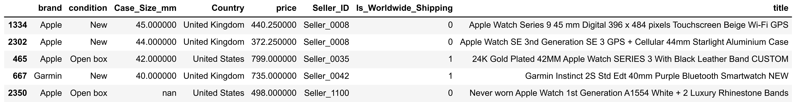

We note that the original data contains listings for brands other than Apple, however Apple accounts for about 66% of the listings.

### Cleaning the Data:
We first standardized the text entries by removing accents and special characters, rendered everything in lower case, and translated all listings to English. We used regex to identify bundle listings, as well as listings containing multiple broken smartwatches for parts.
We then filtered the data to include only Apple products. We noticed inconsistencies between the condition column and the title column. For example, the title claims "Brand New", yet the condition is listed as "Used". In these cases, we replaced what was in the condition column with what we found in the title.

### Feature Engineering
Below is another random sample after using regex to extract the model, gold-plating, titanium, Hermès special editions, ceramic back, and premium bands such as the Milanese loop from the title column, as well as making a power_seller column which indicates whether a seller ID appears in two or more listings.

  

  <em>We note that all Ultra models are titanium</em>

### Summary Statistics

After cleaning and filtering, we are left with the following spread of data points:

<table align="center" width="950">
  <tr>
    <td align="center">
      <h3>Entries</h3>
      <h1>2,328</h1>
    </td>
    <td align="center">
      <h3>Sellers</h3>
      <h1>1,430</h1>
    </td>
    <td align="center">
      <h3>Countries</h3>
      <h1>20</h1>
    </td>
    <td align="center">
      <h3>Models</h3>
      <h1>18</h1>
    </td>
  </tr>
</table>

The vast majority of listings come from the USA, and most watches are Ultra models, which is Apple's flagship family.

  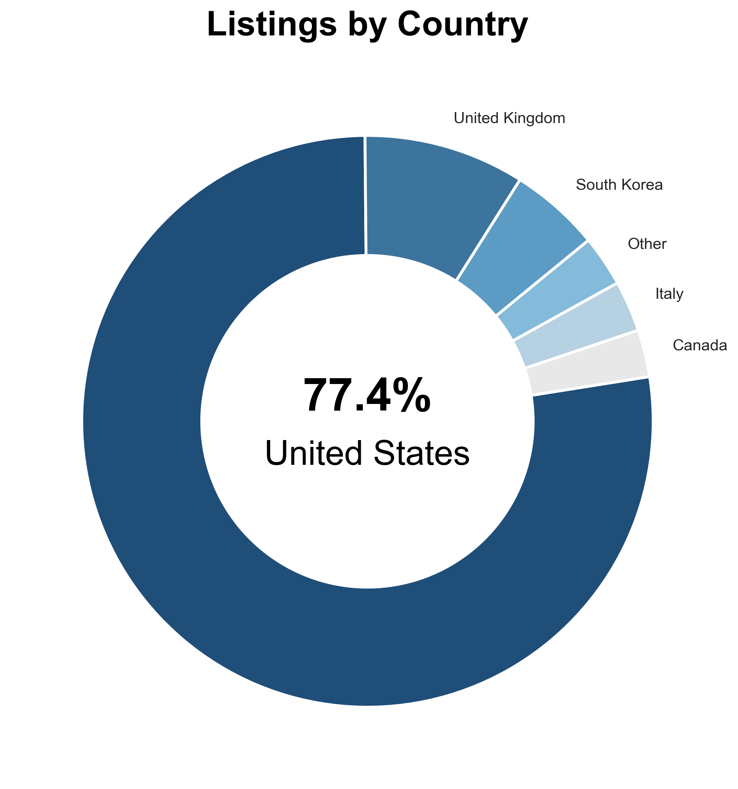
  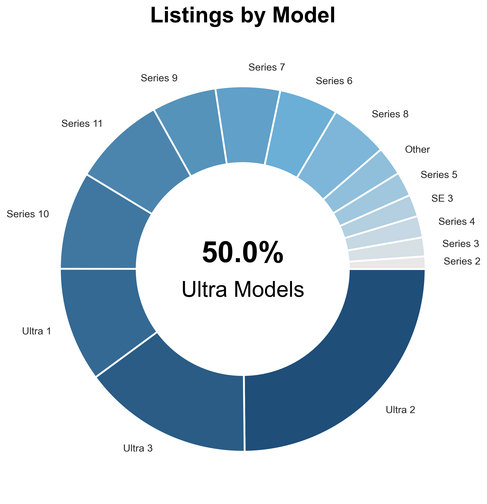

Though most watches come from the USA, the low prices in the UK bring the average down.

  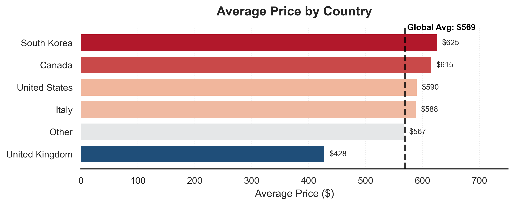

Finally, we see that watches are priced about 10% cheaper when sold by individuals, compared with resellers with multiple listings.

  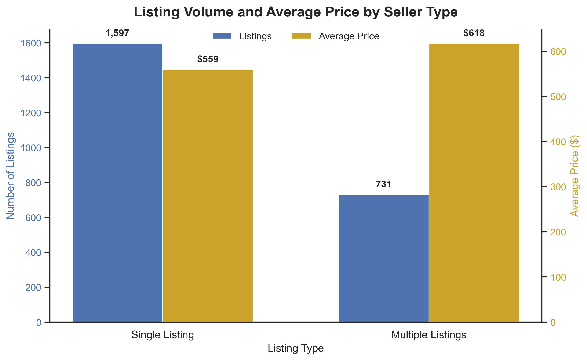

  <em>The difference in price is statistically significant, with p ≪ 0.05</em>

Before going into details about the mathematical model and its construction, we first give an overview of the big ideas, as well as how we will be interpreting the model's results.

## What is SHAP?

SHapley Additive exPlanation(s) was first developed to solve the problem in game theory of how to fairly distribute credit when multiple entities contribute to a project. It is based on the idea of 'synergy' and 'dissonance'. Using features from our data as an example, 'Gold = True' and 'Model = Series 2' will have synergy since most Series 2 watches are gold-plated. In this situation, both will receive a positive dollar score. However 'Gold = True' and 'Model = Ultra 3' are dissonant because none of the Ultra 3s are gold-plated. Thus both will receive a penalty, or negative dollar score in this configuration. In this way, the mathematical model looks at all possible configurations over all the data points and is able to assign positive or negative dollar values to each feature.

Several benefits of using SHAPs vs linear statistics such as the mean are:

1. **SHAPs consider listing volume.**
   Older, gold-plated watches appear in much lower volumes than newer models, and our data is highly skewed towards Ultra models.

2. **SHAPs account for confounding variables.**
  It natively handles highly correlated data.

3. **SHAPs work well with high-cardinality features.**
  There are thousands of individual seller IDs. SHAP is able to quantify the global effect of seller ID.

From a mathematical standpoint, SHAP is the single best way to extract accurate contributions from individual features. Below we will see some examples of how SHAP breaks down the predicted prices of two different smartwatch listings.

### The SHapley Additive exPlanations Force Plot

SHAP breaks down a predicted price into its individual components, showing how each feature raises or lowers the model's prediction.
For example, the diagram below shows an actual listing and how the model explains its price:

  

  <em>Some forces raise the price, while others lower it</em>

**Features that increased the predicted price:**

- **Model:** Ultra 3
- **Condition:** Open Box
- **Case Size:** 49mm
- **Country:** USA

**Features that decreased the predicted price:**

- **Gold:** No
- **Worldwide Shipping:** No
- **Premium Band:** No

The table below shows the actual SHAP values for this particular listings. The units are in USD, and each SHAP value represents a dollar increase or decrease in predicted price. For example, because the model was Ultra 3, the model predicted a $62.08 increase, and a $7.69 decrease in price because worldwide shipping was not offered. 

  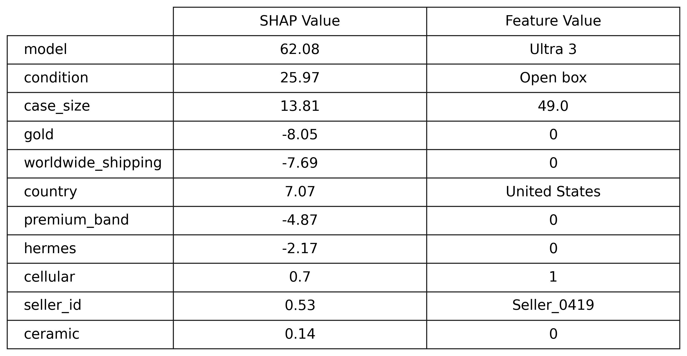

  <em>SHAP values for a typical Ultra 3 model</em>

**It's important to note that SHAP values will be different for each individual listing.** For comparison, below is the force plot and SHAP values for a gold-plated, Series 2 watch. We see that being gold-plated raises the predicted price by $47.59, while being an older Series 2 model brings the predicted price down by $25.76.

  

  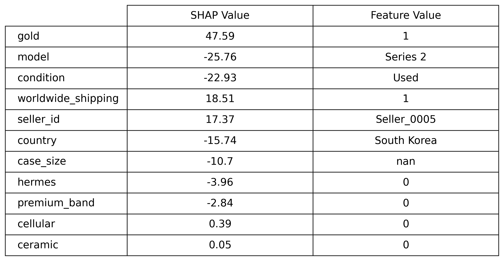

To obtain the global ranking of feature importance that we saw in the introduction and will see again in the next section, we took the average of (the absolute value of) each SHAP value for each individual feature across every listing. This gives us an estimation of the magnitude of feature importance.

## Global Model Results
#### Data Preprocessing and Model Fitting

We used an 80/20 train-test split. Missing values in the case size column were replaced with the median case size calculated from the training set. We then trained the model CatBoostRegressor using condition, case size, worldwide shipping, country, model, Hermès, cellular, gold, premium band, ceramic, power-seller, and seller ID as predictors of price. We achieved an $R^2$ of 0.53 and a mean absolute error of $69. Both CatBoostRegressor and SHAP functionality are included in the open source Python library CatBoost, which is based on a machine learning algorithm that uses gradient boosting on decision trees.

 As we saw in the last section, SHAP values tell us how many dollars the model thinks each feature contributed to price. We can then take the absolute value of each SHAP value across all listings and compute their average. This gives us the ranking of global feature importance that we see below.

  

  
  

  <em>For example, 'model' changes price by +- $30, on average</em>

### Global Results by Feature
Let us look at one example of how we can get a more granular global view by looking at the distribution of SHAP values by feature. Let's look at the number two feature, 'country'.

  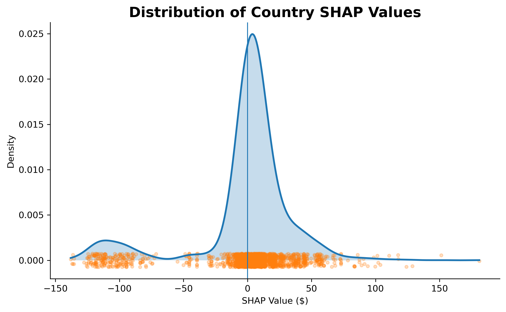
  

The SHAP values are widely distributed, and this is to be expected, as the individual values will depend highly on the particular listing. However, we notice that there is a cluser of points far to the left of zero. This corresponds to UK listings, which have substantially lower prices, as we'll see below.

The following diagram shows deviation from the global average price. Rectangles in blue are priced below average, while rectangles in red are priced above the average.

  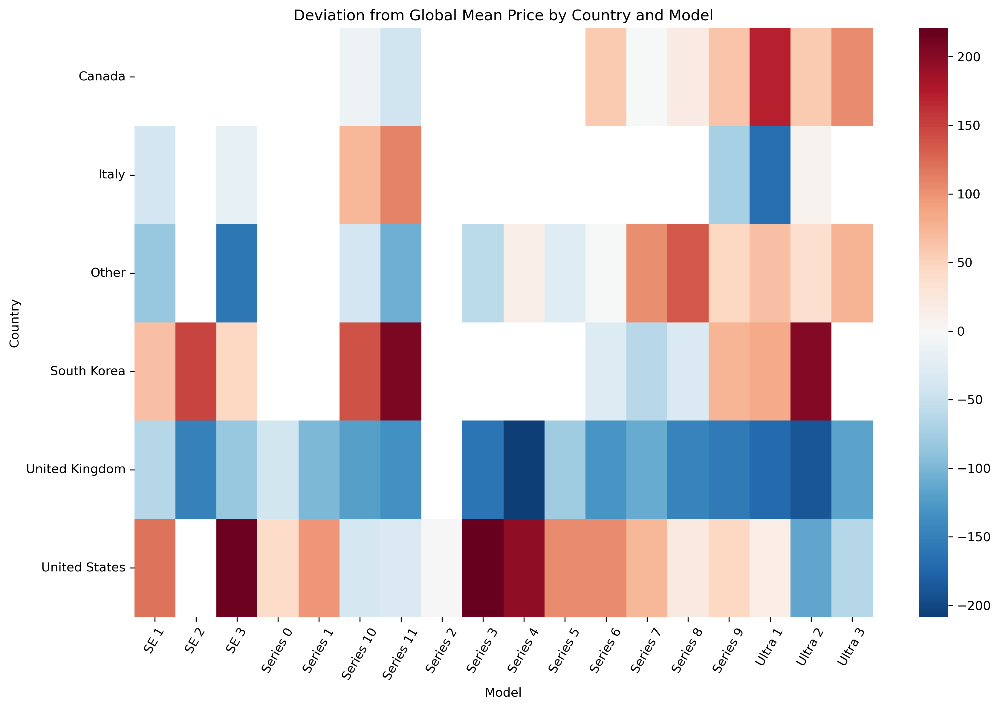
  

  <em>The UK has substantially cheaper listing prices across all models</em>

We note that listings in the UK have consistently lower asking prices across models. 

The CatBoost model has recognized this and adjusted the SHAP values for the UK accordingly. Here is a distribution of those SHAP values.

  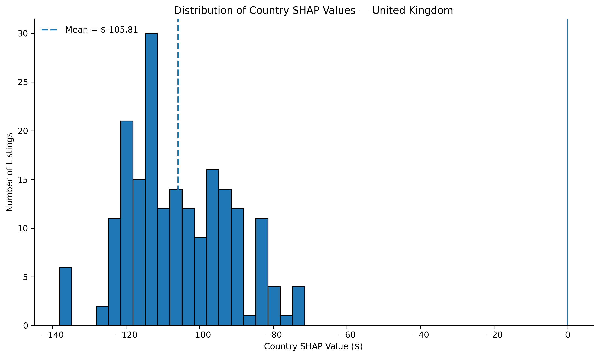
  

  <em>The country SHAP values for all UK listings are negative, meaning the model predicted significantly lower prices on the basis of country</em>

This distribution tells us more than the price deviation by model did. It tells us that our model is predicting that <u>all</u> configurations of smartwatches sold in the UK will be underpriced. In fact, it tells us that a product being listed in the UK is a major component of a low list price. 

## Key Findings

Here we summarize our analyses:

1. **Model is the strongest predictor of list price, though simple comparisons between models can be misleading.**

   Predictably, newer models such as the Ultra 3 have high list prices; however so do some older models, like the Series 2, 3 and 4. Further analysis found that a high percentage of these models are gold-plated. 

2. **The effect of a feature can vary substantially across subsets of the market.**

   Gold-plating is associated with an approximately 150% increase in average list price, yet its overall mean absolute SHAP value is low. This illustrates that a feature can be associated with a large price difference within a particular subset of listings while contributing relatively little to predictions across the overall market.

3. **Country is an important source of variation in list price.**

   Country is the second-most important feature after model. The country-level analysis shows substantial differences in listing prices across markets, particularly in the UK, where listings tend to have substantially lower prices than the corresponding average for similar smartwatch configurations.

## Limitations

1. **Our data contains listings rather than completed sales.**
  A high listing price does not necessarily indicate that a watch actually sold for that amount, and the data therefore describes asking prices in the secondary market rather than realized resale values.

2. **Our data contains missing variables.**
  We are missing key information such as listing description, sale price. A seller cannot generally include every important feature in the title of a listing alone.

3. **Web-scraped data quality**
  Because the dataset was scraped from online marketplaces, it contains inconsistencies in fields such as condition and country and required substantial cleaning and standardization. Feature engineering also relies on extracting information from listing titles using regular expressions, meaning that some characteristics may not have been identified correctly or may not have been present in the title.

## Directions for Future Investigation

A natural next step would be to continue a more granular analysis on the other features. We could analyse seller id and determine if there is a tendency for power sellers to over- or under- price listings. We could also look at how individual sellers (those with just one listing) tend to price their listings, looking with correlations with other features. 

Another interesting direction would be to do several rounds of web-scraping of the same marketplaces over time. This would give an idea of how long things stay up for, and we could use it to estimate the sales price. 

